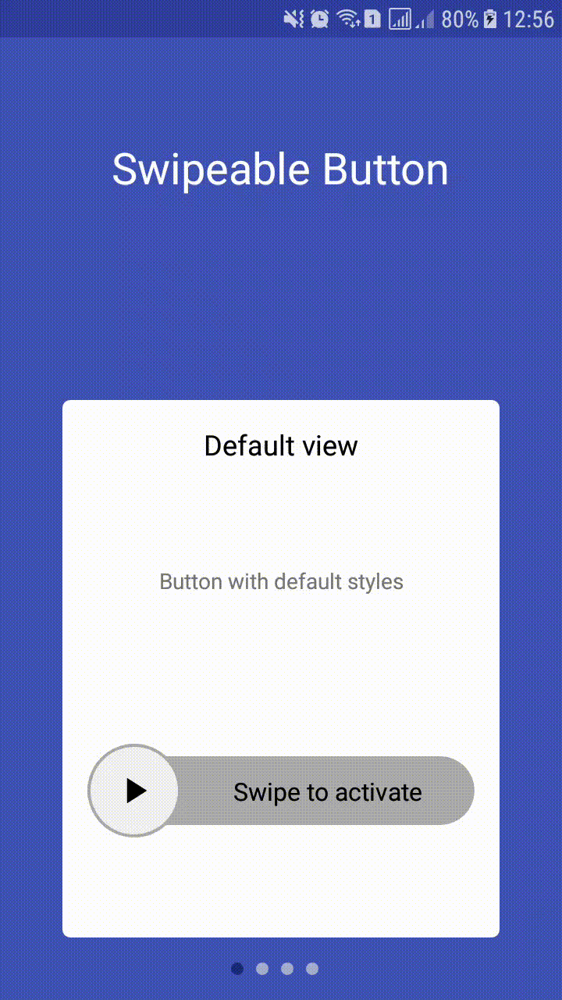

# swipeable-button


## Who we are
Need iOS and Android apps, MVP development or prototyping? Contact us via info@stfalcon.com. We develop software since 2009, and we're known experts in this field. Check out our [portfolio](https://stfalcon.com/en/portfolio) and see more libraries from [stfalcon-studio](https://stfalcon-studio.github.io/).

## Download
Download via Gradle:
```implement 'com.github.stfalcon:'```

## Usage
Just put this code into your layout:
```
<com.stfalcon.swipeablebutton.SwipeableButton
    android:layout_width="match_parent"
    android:layout_height="wrap_content"/>
```

You can use many attributes for more flexibility and convenience of use. Here's the full list:
- isChecked - Initial state. Default state is unchecked.
- isEnabled - Is button enabled. Boolean. True by default
- textChecked - Text for checked state
- textUnchecked - Text for unchecked state
- textColorChecked - Text color when button is checked
- textColorUnchecked - Text color when button is unchecked
- textSize - Text size
- thresholdStart - Value in range [0..1] indicates how much user need to swipe to change status from unchecked to checked. 0.5 by default
- thresholdEnd - Value in range [0..1] indicates how much user need to swipe to change status from checked to unchecked. 0.5 by default
- checkedBackground - Button background for checked state.
- uncheckedBackground - Button background for unchecked state.
- checkedToggleBackground - Toggle background when button is checked.
- uncheckedToggleBackground - Toggle background when button is unchecked.
- checkedIcon - Toggle icon when button is checked
- uncheckedIcon - Toggle icon when button is unchecked

For example:
```
<com.stfalcon.swipeablebutton.SwipeableButton
    android:id="@+id/customSwipeButton2"
    android:layout_width="match_parent"
    android:layout_height="wrap_content"
    android:layout_marginBottom="64dp"
    android:layout_marginLeft="16dp"
    android:layout_marginRight="16dp"
    app:checkedBackground="@drawable/shape_sample_scrolling_view_checked"
    app:checkedIcon="@drawable/ic_visible"
    app:checkedToggleBackground="@drawable/shape_sample_checked_toggle"
    app:durationAnimation="250"
    app:isClickToSwipeEnable="false"
    app:thresholdEnd="0.3"
    app:thresholdStart="0.7"
    app:textChecked="@string/checked_state_text"
    app:textColorChecked="@color/checkedTextColor"
    app:textColorUnChecked="@color/uncheckedTextColor"
    app:textSize="8sp"
    app:textUnchecked="@string/unchecked_state_text"
    app:uncheckedBackground="@drawable/shape_sample_scrolling_view_unchecked"
    app:uncheckedIcon="@drawable/ic_usvisible"
    app:uncheckedToggleBackground="@drawable/shape_sample_unchecked_toggle" />
```
Also set them programmatically
```
swipeableButton.isChecked = true
swipeableButton.isEnable = true
swipeableButton.checkedText = "Checked text"
swipeableButton.uncheckedText = "Unchecked text"
swipeableButton.textSize = resources.getDimensionPixelSize(R.dimen.default_text_size).toFloat()
swipeableButton.swipeProgressToFinish = 0.1
swipeableButton.swipeProgressToStart = 0.3
swipeableButton.checkedTextColor = ContextCompat.getColor(this,R.color.checkedTextColor)
swipeableButton.uncheckedTextColor = ContextCompat.getColor(this,R.color.uncheckedTextColor)
swipeableButton.checkedBackground = ContextCompat.getDrawable(this, R.drawable.shape_sample_scrolling_view_checked)
swipeableButton.uncheckedBackground = ContextCompat.getDrawable(this, R.drawable.shape_sample_scrolling_view_unchecked)
swipeableButton.checkedToggleBackground = ContextCompat.getDrawable(this, R.drawable.shape_sample_checked_toggle)
swipeableButton.uncheckedToggleBackground = ContextCompat.getDrawable(this, R.drawable.shape_sample_unchecked_toggle)
swipeableButton.checkedIcon = ContextCompat.getDrawable(this, R.drawable.ic_done_black)
swipeableButton.uncheckedIcon = ContextCompat.getDrawable(this, R.drawable.ic_pause_black)
```
If you want to change the state programmatically with animation you should use `setSwipeButtonState` method.
```
animateBtn.setOnClickListener {
   swipeButton.setSwipeButtonState(!swipeableButton.isChecked)
}
```
If you want to get event from swipable-button you need to add next listeners:
 - `onSwipedListener`
 - `onSwipedOnListener`
 - `onSwipedOffListener`

Let's take look a small sample:
```
customSwipeButton.onSwipedListener = {
   Log.d(TAG, "onSwiped")
}
customSwipeButton.onSwipedOnListener = {
   Log.d(TAG, "onSwipedOn")
}
customSwipeButton.onSwipedOffListener = {
   Log.d(TAG, "onSwipedOff")
}
```
## License
```
Copyright 2018 stfalcon.com

Licensed under the Apache License, Version 2.0 (the "License");
you may not use this file except in compliance with the License.
You may obtain a copy of the License at

    http://www.apache.org/licenses/LICENSE-2.0

Unless required by applicable law or agreed to in writing, software
distributed under the License is distributed on an "AS IS" BASIS,
WITHOUT WARRANTIES OR CONDITIONS OF ANY KIND, either express or implied.
See the License for the specific language governing permissions and
limitations under the License.
```
